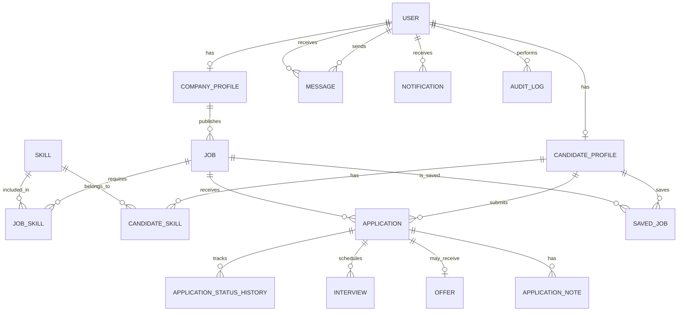

# CareerLens — Database Design

## Overview

This document defines the approved database schema for CareerLens. It serves as the single source of truth for database design, Django models, migrations, API development, and frontend integration.

CareerLens is a recruitment platform where candidates find jobs and submit applications, companies manage job vacancies and applicants, and administrators manage the platform.

### Technology Stack

- **Database:** PostgreSQL
- **Backend:** Django
- **API:** Django REST Framework
- **Frontend:** React
- **ORM:** Django ORM

The application uses one PostgreSQL database shared by the Django backend. Database tables are organized into Django apps according to their responsibilities.

## 1. Database Tables

The design contains 16 application models. Django also provides built-in authentication and permission models, so we do not need to recreate them.

| No. | Model | Django App | Description |
|---|---|---|---|
| 1 | `User` | `accounts` | User authentication, email, role, and account status. |
| 2 | `CandidateProfile` | `accounts` | Candidate education, major, graduation year, and profile details. |
| 3 | `CompanyProfile` | `accounts` | Company information, industry, website, and verification status. |
| 4 | `Job` | `jobs` | Job title, description, salary, location, employment type, and publishing status. |
| 5 | `Skill` | `jobs` | Reusable skills, such as Python, SQL, and React. |
| 6 | `JobSkill` | `jobs` | Connects jobs to their required skills. |
| 7 | `CandidateSkill` | `accounts` | Connects candidates to their skills. |
| 8 | `Application` | `applications` | Connects candidates to jobs and stores application details and current status. |
| 9 | `ApplicationStatusHistory` | `applications` | Records application status changes and timestamps. |
| 10 | `Interview` | `applications` | Stores interview schedules, meeting details, and status. |
| 11 | `Offer` | `applications` | Stores job offers, proposed salary, and response status. |
| 12 | `SavedJob` | `jobs` | Records jobs saved by candidates. |
| 13 | `Message` | `messaging` | Stores messages between users. |
| 14 | `Notification` | `messaging` | Stores user notifications and read/unread status. |
| 15 | `ApplicationNote` | `applications` | Stores private recruiter notes attached to applications. |
| 16 | `AuditLog` | `accounts` | Records important administrative actions. |

This is the full-featured design. Models can be implemented in phases, but changes must remain consistent with this approved schema.

## 2. Entity Relationship Diagram (ERD)

The following diagram describes the relationships between the application's models.



### ERD Cardinality Legend

| Symbol | Meaning |
|---|---|
| `||` | Exactly one |
| `o|` | Zero or one |
| `o{` | Zero or many |
| `|{` | One or many |

For example, one company can publish zero or many jobs, but every job belongs to exactly one company.

The `MESSAGE` entity references `USER` twice: once for the sender and once for the recipient.

## 3. Relationship Details

### 3.1 User and Profiles

One user account can have at most one candidate profile or one company profile.

Administrator accounts use the same `User` model. A separate `Admin` table is not required.

The user role distinguishes:

- `CANDIDATE`
- `COMPANY`
- `ADMIN`

The role identifies the account type. Django's permission fields, including `is_staff` and `is_superuser`, control access to Django's built-in admin site.

**Important:** Assigning `role = "ADMIN"` must not automatically grant superuser privileges.

### 3.2 Company and Job

Relationship: `CompanyProfile` 1:N `Job`

- One company can publish multiple jobs.
- Each job belongs to exactly one company.
- The relationship is implemented through a foreign key on `Job`.

Foreign key: `Job.company_id`

### 3.3 Candidate and Job Applications

Relationship: `CandidateProfile` N:M `Job` through `Application`

- One candidate can apply for multiple jobs.
- One job can receive applications from multiple candidates.
- Each application belongs to one candidate and one job.

A unique constraint on `(candidate_id, job_id)` prevents a candidate from applying to the same job more than once.

### 3.4 Application Status History

Relationship: `Application` 1:N `ApplicationStatusHistory`

Each application stores its current status. Every status change is recorded as a separate history entry.

Example workflow:

`Submitted → Reviewing → Interview → Offered → Hired`

A history record should store the previous status, new status, person who made the change when applicable, note, and timestamp.

### 3.5 Application, Interview, and Offer

- One application can have multiple interviews, allowing multiple interview rounds.
- One application can have zero or one offer in this design.
- An offer records the proposed terms and whether the candidate accepted or declined.

An offer should reference its application through a one-to-one relationship.

### 3.6 Candidate and Saved Jobs

Relationship: `CandidateProfile` N:M `Job` through `SavedJob`

- A candidate can save multiple jobs.
- A job can be saved by multiple candidates.
- A candidate cannot save the same job more than once.

Add a unique constraint on `(candidate_id, job_id)`.

### 3.7 Skills

Skills are stored separately so they can be reused across candidates and job listings.

- `JobSkill` connects jobs to required skills.
- `CandidateSkill` connects candidates to their skills.

Each join table should have a unique constraint on its pair of foreign keys.

### 3.8 Messages and Notifications

- Each message has one sender and one recipient, both referencing `User`.
- Each notification belongs to one user.
- Messages and notifications are stored separately because they serve different purposes.

### 3.9 Application Notes and Audit Logs

- `ApplicationNote` stores private recruiter notes associated with an application.
- `AuditLog` records important actions performed by administrators or other authorized actors.

Audit logs can use `target_type` and `target_id` to identify the affected record. These fields are not ordinary foreign keys unless a generic relationship is implemented.

## 4. Model Fields

The following are the planned core fields. Django supplies an `id` primary key automatically unless a different primary key is configured.

| Model | Main Fields |
|---|---|
| `User` | `email`, `username`, `password`, `first_name`, `last_name`, `role`, `is_active`, `is_staff`, `is_superuser`, `date_joined` |
| `CandidateProfile` | `user_id`, `university`, `major`, `graduation_year`, `bio`, `resume_file` |
| `CompanyProfile` | `user_id`, `company_name`, `industry`, `size`, `location`, `website`, `verification_status` |
| `Job` | `company_id`, `title`, `description`, `location`, `employment_type`, `workplace_type`, `salary_min`, `salary_max`, `status`, `deadline` |
| `Skill` | `name` |
| `JobSkill` | `job_id`, `skill_id` |
| `CandidateSkill` | `candidate_id`, `skill_id`, `proficiency` |
| `Application` | `candidate_id`, `job_id`, `cover_letter`, `status`, `applied_at`, `updated_at` |
| `ApplicationStatusHistory` | `application_id`, `changed_by_id`, `old_status`, `new_status`, `note`, `created_at` |
| `Interview` | `application_id`, `scheduled_by_id`, `scheduled_at`, `meeting_link`, `location`, `status`, `feedback` |
| `Offer` | `application_id`, `salary`, `currency`, `message`, `status`, `sent_at`, `responded_at` |
| `SavedJob` | `candidate_id`, `job_id`, `created_at` |
| `Message` | `sender_id`, `recipient_id`, `text`, `sent_at`, `read_at` |
| `Notification` | `user_id`, `message`, `type`, `is_read`, `created_at` |
| `ApplicationNote` | `application_id`, `author_id`, `note`, `created_at`, `updated_at` |
| `AuditLog` | `actor_id`, `action`, `target_type`, `target_id`, `details`, `created_at` |

### Field Implementation Notes

- Fields ending in `_id` represent foreign keys. In Django models, define these using `ForeignKey` or `OneToOneField`; Django creates the database column.
- Use Django's password hashing and authentication methods. Never store plaintext passwords.
- Use `FileField` for `resume_file` if each candidate has one current resume. If candidates need multiple resumes, introduce a separate `Resume` model.
- Use appropriate `choices` for roles and statuses.
- Validate salary ranges, required fields, deadlines, and relationship ownership.
- Use suitable `on_delete` behavior for each relationship.
- Use `DecimalField` rather than floating-point fields for monetary amounts.

## 5. Django App Organization

Use one PostgreSQL database with models organized into these Django apps.

### `accounts`

Models:

- `User`
- `CandidateProfile`
- `CompanyProfile`
- `CandidateSkill`
- `AuditLog`

Responsibilities:

- Authentication and account management
- Candidate and company profiles
- Candidate skills
- Administrative audit records

### `jobs`

Models:

- `Job`
- `Skill`
- `JobSkill`
- `SavedJob`

Responsibilities:

- Job listing management
- Job requirements and skills
- Saved jobs

### `applications`

Models:

- `Application`
- `ApplicationStatusHistory`
- `Interview`
- `Offer`
- `ApplicationNote`

Responsibilities:

- Application submission and tracking
- Application status history
- Interview scheduling
- Offer management
- Recruiter notes

### `messaging`

Models:

- `Message`
- `Notification`

Responsibilities:

- User-to-user messaging
- Notifications and read status

A separate backend `admin_panel` app is not required just because the React frontend includes an admin dashboard. Django's built-in admin site can be configured separately.

## 6. Django User Model and Initial Migrations

CareerLens should use a custom user model extending Django's `AbstractUser`.

Configure the model before running the initial migrations:

```python
# settings.py

AUTH_USER_MODEL = "accounts.User"
```

The `User` model should include a role field with these choices:

```python
class Role(models.TextChoices):
    CANDIDATE = "CANDIDATE", "Candidate"
    COMPANY = "COMPANY", "Company"
    ADMIN = "ADMIN", "Administrator"
```

Use Django's built-in authentication, password hashing, and permission system instead of implementing them independently.

**Important:** Set `AUTH_USER_MODEL` before the first migration. Changing the user model after database tables and relationships have been established can require a complex migration.

## 7. Database Constraints and Integrity

The following constraints should be included in the Django models:

| Model | Constraint |
|---|---|
| `User` | Unique login identifier; use a unique email if email is the chosen login identifier. |
| `CandidateProfile` | One profile per user. |
| `CompanyProfile` | One profile per user. |
| `JobSkill` | Unique `(job, skill)` pair. |
| `CandidateSkill` | Unique `(candidate, skill)` pair. |
| `Application` | Unique `(candidate, job)` pair. |
| `Offer` | At most one offer per application. |
| `SavedJob` | Unique `(candidate, job)` pair. |

Also enforce application-level rules:

- Only candidates can submit job applications.
- Only authorized company users can manage their own company's jobs and applicants.
- Only authorized recruiters can schedule interviews, issue offers, and write recruiter notes.
- Only authorized administrators can perform administrative actions.
- Candidates must not be able to access private recruiter notes or administrative audit logs.

Database constraints protect data integrity, while Django permissions and API-level authorization protect access.

## 8. Implementation Order

Implement the schema in phases.

### Step 1: User and Profiles

Create:

- `User`
- `CandidateProfile`
- `CompanyProfile`

Configure the custom user model before running the first migrations.

### Step 2: Jobs and Skills

Create:

- `Job`
- `Skill`
- `JobSkill`
- `CandidateSkill`
- `SavedJob`

### Step 3: Applications

Create:

- `Application`
- `ApplicationStatusHistory`

Implement application submission, duplicate-application prevention, and status tracking.

### Step 4: Recruitment Workflow

Create:

- `Interview`
- `Offer`
- `ApplicationNote`

Implement interview scheduling, offer management, and recruiter notes.

### Step 5: Communication and Administration

Create:

- `Message`
- `Notification`
- `AuditLog`

Implement messaging, notifications, and administrative activity records.

## 9. Migration Workflow

After changing Django models, generate and apply migrations:

```powershell
python manage.py makemigrations
python manage.py migrate
```

- `makemigrations` generates migration files from model changes.
- `migrate` applies pending migrations to the configured database.

Review generated migrations before applying them, especially when removing fields, changing relationships, or introducing required fields to tables containing data.

Commit migration files to Git so all team members can apply the same schema changes.

Do not manually modify PostgreSQL tables independently of Django models and migrations.

## 10. Rules for Future Database Changes

This schema is the approved baseline, not a claim that no future changes will ever be needed.

- Adding a new feature may require adding a model or field.
- Adding a table does not normally require redesigning the existing database.
- Changing a relationship may require a data migration and updates to backend APIs.
- Renaming or deleting a field requires care because existing data or application code may depend on it.
- Back up important data before risky production migrations.
- Update this document when an approved schema change is made.

Keep Django models, migrations, API serializers, views, and frontend API usage consistent.

## Final Decision

CareerLens will use one PostgreSQL database with a custom Django user model and 16 application models organized into four Django apps.

There will be no separate `Admin` model because administrator accounts use the shared `User` model and Django permissions.

This document is the single approved database reference for the CareerLens team. Any future schema change should be deliberate, documented, and implemented through Django migrations.